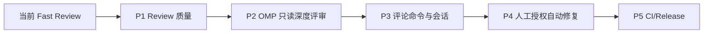

# oh-my-robot OMP 接入迁移计划

## 1. 目标

把当前 `oh-my-robot` 从“只看 PR Diff 的 DeepSeek Review 服务”逐步扩展为：

```text
Fast Review：GitHub API + Diff + DeepSeek
Deep Review：PR 专属 Worktree + omp RPC + 只读仓库工具
```

长期目标：在只读深度评审稳定后，支持维护者明确授权的自动修复 Draft PR。

本计划允许复用 `oh-my-pi/python/robomp` 的成熟实现，但采用 **迁移最小模块、适配当前契约、独立打包** 的方式，不在运行时直接依赖相邻 `robomp` 包。

## 2. 当前基线

当前项目已经具备：

- GitHub PR Webhook 和 REST API；
- SQLite durable queue；
- head SHA 新鲜度校验和 refresh；
- WorkerPool 与同 PR 串行；
- Admin 查询、Replay、Manual Review；
- 结构化 ReviewResult；
- JSON 日志和指标；
- 只读边界：不 Clone、不执行、不修改、不 Push。

第一阶段约束继续有效：

- OMP 默认只读；
- 不把 GitHub Token 放入 Agent 环境；
- 不开放 `edit`、`write`、`git push`；
- 不直接修改默认分支；
- 不创建自动修复 PR；
- 不引入第二套队列或数据库。

## 3. 复用原则

### 3.1 可以迁移的来源

| 能力 | 参考源码 | 迁移方式 |
|---|---|---|
| GitHub API | `oh-my-pi/python/robomp/src/github_client.py` | 提取分页、评论、Review、错误处理方法，适配 `GitHubPort` |
| OMP 子进程 | `oh-my-pi/python/robomp/src/worker.py` | 提取 RPC 启动、超时、退出码和 transcript 逻辑 |
| Worktree | `oh-my-pi/python/robomp/src/sandbox.py` | 提取隔离目录、分支和清理逻辑，改为 PR/head 维度 |
| Host Tool | `oh-my-pi/python/robomp/src/host_tools.py` | 第一阶段只保留只读 GitHub 工具，写工具后置 |
| 事件路由 | `oh-my-pi/python/robomp/src/github_events.py` | 提取 mention、bot 事件过滤和权限判断 |
| 任务编排 | `oh-my-pi/python/robomp/src/tasks.py` | 提取任务输入和 session 恢复思想，不复制 Issue 业务分支 |
| 状态存储 | `oh-my-pi/python/robomp/src/db.py` | 提取 session/tool audit 设计，合并进当前 SQLite 状态模型 |
| Prompt 模板 | `oh-my-pi/python/robomp/src/prompts/` | 提取模板加载机制，重新编写 PR Review persona |
| Git 写入门禁 | `oh-my-pi/python/robomp/src/git_ops.py` | 仅在自动修复阶段迁移，保留作者、分支、脏工作区校验 |

### 3.2 禁止的复用方式

禁止直接在生产代码中使用：

```python
from robomp.worker import WorkerPool
from robomp.sandbox import SandboxManager
```

原因：

- 两个项目配置模型不同；
- 两个项目数据库状态不同；
- roboomp 同时处理 Issue、PR、Release 和写操作；
- Docker 打包和 Python import path 不稳定；
- 上游修改会无意改变当前服务行为。

正确方式：

```text
阅读并验证 roboomp 实现
  -> 复制最小可用模块到 reviewbot/
  -> 改成当前项目的 Port、Settings、QueueStore 和模型
  -> 删除无关 Issue/Release 分支
  -> 为当前契约补测试
```

`oh-my-pi` 使用 MIT 许可证。迁移源码时保留必要的许可证和来源说明。

---

## 4. 总体阶段图



### 阶段顺序

| 阶段 | 主要结果 | 是否允许写仓库 |
|---|---|---:|
| P1 | Diff 分片、覆盖摘要、规则、finding、行级评论 | 否 |
| P2 | OMP RPC、PR Worktree、只读工具、Session | 否 |
| P3 | PR 评论命令、Issue 路由、持续对话 | 否 |
| P4 | 维护者授权修复、测试、Draft PR | 仅受控授权 |
| P5 | CI/Release 自动诊断和修复 | 默认关闭 |

## 5. 每个模块的 Review 闭环

每个模块必须独立执行：

```text
明确契约
  -> 迁移或实现模块
  -> 添加行为测试
  -> 定向测试
  -> 独立 Reviewer 检查完整 diff
  -> 自动修复当前范围内的确认 Finding
  -> 重跑测试和 Ruff
  -> 二次 Review
  -> 标记 verified
  -> 开始下一个模块
```

### Review 检查项

- 状态转换和幂等；
- 子进程、Worktree、SQLite 并发；
- Token、Secret、URL 和仓库内容泄漏；
- Prompt Injection；
- 超时、取消、重试和恢复；
- 工具权限边界；
- OMP 输出 Schema；
- 是否引入对 `robomp` 运行时依赖；
- 是否越过当前阶段的只读/写入边界。

### 自动修复边界

- 只自动修复当前模块范围内的确认问题；
- 修复根因，不通过吞异常或放宽安全约束；
- 范围外问题记录但不顺手扩展；
- 修复后必须重跑原先能暴露问题的测试；
- 二次 Review 无未解决 P0～P2 Finding 才能进入下一模块。

---

# P1：Review 质量基础

P1 不依赖 OMP，先提升现有 Fast Review 的信息质量。

## P1-1 Diff 分片与覆盖摘要

### 目标

解决大 PR 直接省略后续文件的问题。

### 主要落点

```text
src/reviewbot/diff.py
src/reviewbot/reviewer.py
src/reviewbot/service.py
src/reviewbot/renderer.py
```

### 实现

```text
ChangedFile[]
  -> patchless/二进制/Lockfile分类
  -> 安全敏感文件优先级
  -> 按字节或 Token 预算生成 DiffBatch[]
  -> 每个 Batch 独立 Review
  -> 合并 ReviewResult
  -> finding 去重
  -> 生成覆盖摘要
```

### 出口

- 大型 PR 不再静默漏审；
- 评论显示 reviewed/omitted 文件和批次数；
- 每个 Batch 失败不会丢失其他 Batch 结果；
- 同一 head 仍只发布一条评论。

## P1-2 仓库和路径级规则

### 主要落点

```text
src/reviewbot/config.py
src/reviewbot/service.py
新增 src/reviewbot/rules.py
```

### 规则来源

```text
全局规则
  -> base 分支仓库规则
  -> 路径规则
  -> Review 模式
```

规则必须从可信 base 来源读取，不能将 PR 新提交的规则直接当作系统指令。

## P1-3 Finding 生命周期

### 主要落点

```text
src/reviewbot/models.py
src/reviewbot/storage.py
src/reviewbot/renderer.py
新增 src/reviewbot/findings.py
```

### 状态

```text
new
active
resolved
relocated
```

使用稳定指纹追踪同一个问题在不同 head 中的状态变化。

## P1-4 行级评论和 Check Run

### 复用来源

```text
oh-my-pi/python/robomp/src/github_client.py
```

### 主要改动

- 扩展当前 `GitHubPort`；
- 增加 PR Review Comment API；
- 将有效 finding 映射到当前 Diff 行；
- 无法定位的 finding 继续进入汇总评论；
- 增加 Check Run，但默认不阻断合并。

---

# P2：OMP 只读深度评审

## P2-1 统一 Review Mode

新增配置：

```text
ROBOT_REVIEW_MODE=fast
```

可选值：

```text
fast
 deep
```

- `fast`：现有 GitHub API + Diff + DeepSeek；
- `deep`：PR Worktree + OMP RPC + 只读工具。

默认必须是 `fast`。

## P2-2 PR 专属 Worktree

### 复用来源

```text
oh-my-pi/python/robomp/src/sandbox.py
```

### 新模块

```text
src/reviewbot/sandbox.py
```

### 契约

```text
ensure_workspace(repository, pr_number, head_sha) -> Workspace
cleanup_workspace(workspace_id) -> None
```

Worktree 要求：

- 每个 PR/head 隔离；
- 不修改主工作区；
- head SHA 固定；
- 服务重启可识别遗留目录；
- 任务结束清理；
- 清理失败进入 Admin 可见状态。

## P2-3 OMP RPC Worker

### 复用来源

```text
oh-my-pi/python/robomp/src/worker.py
```

### 新模块

```text
src/reviewbot/omp_worker.py
```

### 契约

```text
run_deep_review(
    workspace,
    prompt,
    session_dir,
    timeout_seconds,
) -> ReviewExecution
```

必须处理：

- OMP 子进程启动失败；
- 超时；
- 非零退出码；
- 输出过大；
- 非法 ReviewResult；
- 取消和进程树回收；
- transcript 恢复；
- 模型/工具使用量统计。

## P2-4 只读工具绑定

### 复用来源

```text
oh-my-pi/python/robomp/src/host_tools.py
```

第一版只允许：

```text
read
 glob
 grep
 lsp
```

禁止：

```text
write
edit
bash
push
merge
```

Agent 环境不得包含：

```text
GITHUB_TOKEN
GITHUB_WEBHOOK_SECRET
ROBOT_ADMIN_TOKEN
ROBOMP_GH_PROXY_HMAC_KEY
```

## P2-5 Session 和工具审计

### 复用来源

```text
oh-my-pi/python/robomp/src/db.py
oh-my-pi/python/robomp/src/persona.py
```

### 新模块

```text
src/reviewbot/sessions.py
src/reviewbot/audit.py
```

Session 关联：

```text
repository
pull_request_number
head_sha
session_id
transcript_path
state
last_event_id
updated_at
```

head SHA 改变时写入边界，不能无条件复用旧代码结论。

### P2 出口

- fast/deep 模式独立可用；
- OMP 只能读取当前 Worktree；
- GitHub Token 不进入 Agent；
- 工具调用可审计；
- OMP 超时和崩溃可恢复；
- 同一个 head SHA 仍然幂等；
- Prompt Injection 测试通过。

---

# P3：评论命令与社区交互

## P3-1 GitHub 事件路由

### 复用来源

```text
oh-my-pi/python/robomp/src/github_events.py
```

支持：

```text
issues.opened
issue_comment.created
pull_request_review.submitted
pull_request_review_comment.created
```

必须先处理：

- Bot 自己事件过滤；
- mention 提取；
- author association；
- 事件 Delivery 幂等；
- 权限和频率限制。

## P3-2 只读评论命令

第一批：

```text
@oh-my-robot status
@oh-my-robot review
@oh-my-robot review security
@oh-my-robot explain P1-1
```

命令不能触发代码写入。

## P3-3 Issue 分类和标签建议

### 复用来源

```text
oh-my-pi/python/robomp/src/tasks.py
oh-my-pi/python/robomp/src/persona.py
```

第一版只输出建议：

```text
bug
question
documentation
enhancement
proposal
invalid
duplicate
needs_info
```

默认不自动关闭 Issue，不自动修改标签。

## P3-4 Follow-up Session

评论命令必须绑定当前 head SHA。新的 Push 触发新边界，旧 session 只能作为历史上下文，不能替代当前代码读取。

---

# P4：人工授权自动修复

只有 P2 的 Worktree、OMP、工具隔离和审计完成后才能实施。

## P4-1 Host Tool 写操作

### 复用来源

```text
oh-my-pi/python/robomp/src/host_tools.py
oh-my-pi/python/robomp/src/git_ops.py
```

最小工具：

```text
gh_get_pull_request
gh_get_comments
gh_push_branch
gh_open_draft_pr
gh_create_comment
```

每个工具必须：

- 参数校验；
- 仓库白名单校验；
- 分支校验；
- 权限校验；
- 审计；
- 凭据脱敏；
- 可重复行为。

## P4-2 自动修复链路

```text
维护者 @oh-my-robot fix
  -> 验证授权
  -> 创建独立 Worktree
  -> OMP 复现问题
  -> 修改代码
  -> 运行 formatter/check/test
  -> 生成 Repro/Cause/Fix/Verification
  -> Host Tool 门禁
  -> Push 机器人分支
  -> 创建 Draft PR
```

绝不允许：

- 直接修改默认分支；
- 没有复现记录就创建 PR；
- 测试失败仍创建 PR；
- Agent 直接持有 GitHub Token；
- 自动合并。

## P4 出口

- 写操作默认关闭；
- 未授权命令不能修改仓库；
- 测试失败不会 Push；
- Draft PR 可追溯到事件、Session、工具调用和操作者；
- 人工可以停止任务和清理 Worktree。

---

# P5：CI/Release Sentinel

最后实施，默认关闭。

### 复用来源

```text
oh-my-pi/python/robomp/src/tasks.py
oh-my-pi/python/robomp/src/host_tools.py
oh-my-pi/python/robomp/src/db.py
```

功能：

- 监听 `workflow_run.completed`；
- 读取失败 Job、步骤和日志尾部；
- 关联 commit、PR、Release；
- 使用独立 Release Worktree；
- 限制自动修复轮次；
- 持久化 `awaiting_ci / fixing / green / failed / superseded`；
- 支持人工停止和恢复。

---

## 6. 目录和代码落点

```text
src/reviewbot/
├── admin.py             当前 Admin 控制面
├── github_client.py     当前 GitHub REST 适配层
├── diff.py              Diff 分片和覆盖
├── findings.py          P1 finding 生命周期
├── rules.py             仓库/路径规则
├── sandbox.py           P2 Worktree
├── omp_worker.py        P2 OMP RPC
├── host_tools.py        P2 只读/P4 写入工具
├── sessions.py          P2/P3 Session
├── audit.py             工具审计
├── events.py            P3 事件路由
├── tasks.py             P3/P4 任务编排
└── git_ops.py           P4 Git 写入门禁
```

设计规则：

- 平台访问统一经过 `GitHubPort` 或受控 Host Tool；
- Agent 不直接调用 GitHub API；
- `main.py` 只负责应用组装和路由注册；
- 状态和事件统一进入当前 `QueueStore`；
- 不在生产环境 import 相邻 `robomp` 包；
- 迁移源码保留 MIT 许可证要求和来源说明。

## 7. 统一验收矩阵

| 领域 | 场景 | 结果 |
|---|---|---|
| Diff | 大 PR、patchless、二进制 | 覆盖范围准确，不虚构 finding |
| Worktree | 同 PR 并发、不同 PR 并发 | 同 PR 隔离，不污染主目录 |
| RPC | OMP 超时、崩溃、非零退出 | 任务可取消、可恢复、可重放 |
| 工具 | 越权读写、路径穿越 | 拒绝并留下审计 |
| 安全 | Prompt Injection、Token 环境变量 | Agent 不能改变权限或取得 Token |
| Session | 服务重启、head 变化 | 可恢复，不复用旧代码结论 |
| 评论命令 | 未授权、重复命令、机器人自触发 | 拒绝、幂等、不循环 |
| 自动修复 | 无复现、测试失败、脏工作区 | 不 Push、不创建 PR |
| 写入 | 分支越界、作者错误、跳过检查 | Host Tool 拒绝并审计 |
| Release | stale/cancelled/skipped CI | 状态正确，不误修复 |

## 8. 推荐实施顺序

```text
P1 Diff 分片与覆盖摘要
  -> P1 仓库/路径规则
  -> P1 finding 生命周期
  -> P1 行级评论/Check Run
  -> P2 PR Worktree
  -> P2 OMP RPC Worker
  -> P2 read/glob/grep/lsp
  -> P2 Session/审计/Token隔离
  -> P3 评论命令
  -> P3 Issue 分类
  -> P4 人工授权自动修复
  -> P4 Draft PR
  -> P5 CI/Release Sentinel
```

不要跳过 P2 的只读安全阶段直接开发自动修复。

## 9. Definition of Done

整个 OMP 接入计划完成前必须满足：

- 所有迁移模块均有契约测试；
- 每个模块完成独立 Review、自动修复和二次 Review；
- OMP 只读模式默认安全；
- Worktree、Session、工具调用和事件均可恢复；
- GitHub Token 不进入 Agent；
- 所有写操作经过 Host Tool；
- 自动修复默认关闭；
- CI/Release 默认关闭；
- `pytest -q`、`ruff check src tests` 和运行时冒烟均通过。
