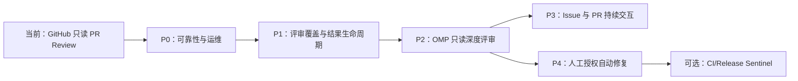

# oh-my-robot 功能补全推荐地图

## 1. 目标与边界

`oh-my-robot` 当前是一个 **GitHub Pull Request 只读 AI Review 服务**：接收 `pull_request` Webhook，进入 SQLite 队列，调用 GitHub REST API 获取 PR 和 Diff，调用 DeepSeek 生成结构化意见，再发布一条带 head SHA 标记的 Markdown 评论。

本地图的目标不是一次性复制 roboomp，而是按风险递增的方式演进：

1. 先把当前只读 Review 做到可恢复、可观测、结果不落后。
2. 再补大 Diff、增量评审和仓库级深度理解。
3. 最后才引入 OMP RPC、Issue 自动分流和人工授权的代码修改。

硬边界：在完成安全隔离和人工授权前，机器人不得 Clone、执行、修改、Push 或合并用户代码。

---

## 2. 当前基线

| 已有能力 | 当前落点 | 状态 |
|---|---|---|
| GitHub PR Webhook 验签 | `src/reviewbot/main.py`、`webhook.py` | 已有 |
| GitHub REST 客户端 | `src/reviewbot/github_client.py` | 已有 |
| 文件和评论分页 | `github_client.py` | 已有 |
| SQLite 事件队列 | `src/reviewbot/storage.py` | 已有 |
| 单 Worker 消费和有限重试 | `src/reviewbot/worker.py` | 已有 |
| PR/head SHA 幂等记录 | `storage.py`、`service.py` | 已有 |
| Diff 新增行定位 | `src/reviewbot/diff.py` | 已有 |
| JSON 结构化评审 | `src/reviewbot/reviewer.py` | 已有 |
| Markdown 汇总评论 | `src/reviewbot/renderer.py` | 已有 |
| 容器部署 | `Dockerfile`、`docker-compose.yml` | 已有 |

当前主要缺口：

- 模型评审期间 PR 更新后，发布前没有再次确认 head SHA。
- 单 Worker 串行，单个慢 PR 会阻塞其他 PR。
- Diff 超限时按文件整体省略，没有分片评审。
- 只有健康检查，没有事件查询、失败重放和人工触发入口。
- 没有结构化耗时、Token、覆盖率和失败原因指标。
- 不能读取仓库上下文、调用 LSP 或恢复 PR 会话。
- 没有 Issue 分流、评论命令和自动修复能力。

---

## 3. 总体路线图



### 阶段出口总表

| 阶段 | 目标 | 是否允许写仓库 | 依赖 | 出口标准 |
|---|---|---:|---|---|
| P0 | 可靠接收、恢复和定位任务 | 否 | 当前基线 | 旧结果不发布，任务可查询和重放 |
| P1 | 提高大 PR 覆盖率和 Review 可用性 | 否 | P0 | 文件、finding、评论状态可追踪 |
| P2 | 使用 OMP 读取仓库上下文 | 否 | P0；推荐 P1 | Agent 只能读，工具调用可审计 |
| P3 | Issue/PR 对话和社区分流 | 否 | P2 的会话与权限基础 | 每个事件可路由、去重、恢复 |
| P4 | 生成修复分支和 PR | 仅授权后 | P2、P3、安全隔离 | 无复现或测试失败时绝不开 PR |
| P5 | 自动诊断 CI/Release | 受控写入 | P4 的工作区和审计 | 默认关闭，状态可恢复、可人工接管 |

---

## 4. P0：可靠性与运维基础

这是下一阶段，优先级最高。它不改变机器人“只读 Review”的产品边界。

### P0-1 发布前 head SHA 二次校验

**问题：** 模型调用期间作者可能继续 Push。当前服务按旧 Diff 生成评论，之后直接发布。

**方案：**

```text
开始任务时读取 head = A
  -> 获取文件、调用模型
  -> 发布前重新读取 PR
  -> 当前 head == A：允许发布
  -> 当前 head != A：标记 superseded，旧结果不发布
```

**涉及位置：** `service.py`、`storage.py`。

**验收：** 测试中让 GitHub 客户端在模型调用期间返回新 SHA；旧 SHA 不产生评论，新 SHA 可由下一次 Webhook 评审。

### P0-2 任务状态与同 PR 串行

增加可恢复状态：

```text
queued -> running -> succeeded
                 -> failed
                 -> skipped
                 -> superseded
```

引入并发上限，但以 `(repository, pull_request_number)` 为串行键：

- 不同 PR 可以并发；
- 同一 PR 不能并发评审；
- 同一 head SHA 仍只能成功一次；
- 服务重启后 `running` 任务重新排队；
- 取消任务必须留下可解释原因。

**涉及位置：** `storage.py`、`worker.py`、`config.py`。

**验收：** 同一 PR 同时收到多个 Webhook 时只执行一个有效评审；不同 PR 不互相等待；进程重启后任务不丢失。

### P0-3 管理查询与失败重放

增加内网或管理密钥保护的接口：

```text
GET  /admin/events
GET  /admin/events/{delivery_id}
GET  /admin/reviews
POST /admin/events/{delivery_id}/replay
POST /admin/repos/{owner}/{repo}/pulls/{number}/review
```

规则：

- 重放必须复用现有幂等逻辑；
- 不能通过重放绕过仓库白名单；
- 默认只允许重放 `failed`、`skipped` 或明确指定任务；
- 不把 Token、Webhook Secret、完整 Diff 写入响应或日志。

**涉及位置：** `main.py`、`storage.py`。

### P0-4 结构化日志和运行指标

至少记录以下字段：

```text
 delivery_id
 repository / pull_request / head_sha
 event_action / state / attempts
 diff_files / diff_bytes / omitted_files
 model_duration_ms / github_duration_ms
 finding_count / review_rank
 error_type / retryable
```

提供 `/metrics` 或等价的本地查询，先不绑定 Prometheus。重点不是增加监控依赖，而是让一次失败能够回答：任务在哪一步、为何失败、是否重试、是否产生评论。

### P0 出口

- Webhook 重投不产生重复任务或重复评论；
- 评审期间 Push 不会发布旧 head 结果；
- 服务重启可恢复任务；
- 管理员能查询失败原因并安全重放；
- 不同 PR 可并发，同一 PR 保持串行；
- 所有外部请求和模型调用有可关联日志。

---

## 5. P1：评审覆盖率与结果生命周期

### P1-1 Diff 分片评审

当前 Diff 超过 `ROBOT_MAX_DIFF_BYTES` 时会省略后续文件。改为：

```text
文件过滤与排序
  -> 按字节或 Token 预算拆成多个 batch
  -> 每个 batch 独立评审
  -> 合并 findings
  -> 按稳定指纹去重
  -> 统一计算 verdict 和 rank
```

建议优先级：

1. 鉴权、权限、SQL、Shell、CI 和配置文件；
2. 业务源代码；
3. 测试；
4. Lockfile、生成物、二进制和纯格式变化。

每个 PR 要有批次数和覆盖摘要；模型没有看到的文件不能生成意见。

**涉及位置：** `diff.py`、`reviewer.py`、`service.py`、`renderer.py`。

### P1-2 仓库和路径级规则

规则合并顺序建议为：

```text
全局默认规则
  -> 仓库 base 分支规则
  -> 路径规则
  -> 本次评审模式
```

规则必须从 base SHA 或受信任配置读取，不能直接信任 PR 新提交中的规则文件作为系统指令。支持的配置应限制在白名单字段内，不允许规则文件执行任意命令。

### P1-3 finding 生命周期

为每条 finding 生成稳定指纹，追踪：

```text
new       本轮新增
active    连续存在
resolved  新版本中消失
relocated 代码位置变化但问题仍存在
```

评论中展示“新增问题”和“仍存在问题”，而不是每次 Push 都堆一条完整评论。

### P1-4 评论更新和行级定位

优先使用 GitHub PR Review Comment API 将 finding 绑定到 Diff 行；汇总评论保留结论、批次覆盖和测试建议。

如果行级评论受权限或 API 限制：

- 保留固定 marker；
- 评论中使用文件行链接；
- finding 编号和指纹保持稳定；
- 不把无法定位的意见发布成行级阻断意见。

### P1-5 Commit Status / Check Run

评审状态可以映射为：

```text
评审中       -> pending
无高优先级问题 -> success 或 neutral
存在可信 P0/P1 -> failure
外部服务失败   -> error
```

默认不阻断合并。启用门禁前必须保证模型错误不会被误判为代码失败，并提供人工 override。

### P1 出口

- 大型 PR 的文件不会因为总大小被静默漏审；
- 评论明确展示已检查和未检查范围；
- 同一问题在多次 Push 中可追踪；
- finding 只能定位到当前有效 Diff 行；
- Review 状态与评论内容一致；
- 模型服务失败与代码问题不会混为一谈。

---

## 6. P2：OMP 只读深度评审

这一阶段才真正引入 OMP，不直接复制 roboomp 的写操作能力。

### 目标

从“模型只看 Diff”升级为“模型可以在隔离工作区内只读理解仓库”：

- 查看相关文件；
- 搜索符号和调用方；
- 使用 LSP 查询定义、引用和类型；
- 读取测试与配置；
- 运行只读分析命令或预先批准的测试命令；
- 生成结构化 Review 结果，但不能修改或 Push。

### 建议架构

```mermaid
flowchart TD
    Event[GitHub PR Webhook] --> Queue[SQLite durable queue]
    Queue --> Dispatcher[Review dispatcher]
    Dispatcher --> Workspace[PR-specific read-only worktree]
    Workspace --> RPC[omp --mode rpc]
    RPC --> Tools[read / glob / grep / lsp]
    RPC --> Result[结构化 ReviewResult]
    Result --> GitHub[评论或 Check Run]

    Token[GitHub Token] -.不进入 Agent 环境.-> RPC
    Audit[工具调用审计] <-- Tools
```

### 必须复用的 OMP 设计

| 能力 | 参考位置 | 在本项目中的要求 |
|---|---|---|
| RPC Agent 驱动 | `python/robomp/src/worker.py` | 子进程超时、退出码和输出边界清晰 |
| 工作区生命周期 | `python/robomp/src/sandbox.py` | 每个 PR/任务隔离，结束后清理 |
| Host Tool 边界 | `python/robomp/src/host_tools.py` | 所有 GitHub 访问由受控工具完成 |
| GitHub 适配 | `python/robomp/src/github_client.py` | 复用分页、错误和权限处理经验 |
| 任务持久化 | `python/robomp/src/db.py` | session、任务、工具审计可恢复 |

### 安全门

- Agent 环境中不能出现 GitHub Token、Webhook Secret 或代理 HMAC Key；
- 默认禁止网络、Push、写文件和任意 Shell；
- 只允许访问当前 worktree；
- 每个工具调用记录参数、结果摘要和耗时；
- Prompt Injection 只作为不可信仓库数据处理；
- Agent 超时、崩溃或输出格式错误都进入可重放状态；
- 深度模式必须有单独的成本和超时上限。

### P2 出口

- 快速 Diff 模式和深度 OMP 模式可以独立开关；
- 深度模式在仓库内执行只读分析，不修改工作区；
- 服务重启后可恢复或安全终止 session；
- Agent 的 Token 隔离和工具审计有测试证据；
- 同一个 head SHA 的深度评审仍保持幂等。

---

## 7. P3：Issue、评论命令与持续会话

### P3-1 事件范围

在 PR Review 稳定后，再监听：

```text
issues.opened
issue_comment.created
pull_request_review.submitted
pull_request_review_comment.created
```

事件路由参考 roboomp 的 `github_events.route()`，但先只做只读或建议性动作。

### P3-2 Issue 分类

首批分类：

```text
bug
question
documentation
enhancement
proposal
invalid
duplicate
needs_info
```

建议动作：

- 自动生成分类建议；
- 给维护者提供标签建议；
- 对信息不足的问题请求复现步骤和环境；
- 自动回复必须设置频率限制；
- 默认不自动关闭 Issue。

### P3-3 PR 评论命令

建议支持：

```text
@oh-my-robot review
@oh-my-robot review security
@oh-my-robot review tests
@oh-my-robot explain P1-1
@oh-my-robot status
```

命令规则：

- 忽略机器人自己发布的评论；
- 命令解析结果必须经过权限检查；
- 消耗模型额度的命令需要限流；
- 同一个命令有 command ID，避免重复执行；
- `explain` 重新依据当前 head，不盲信历史结论。

### P3-4 持久化会话

为每个 `(repository, issue_or_pr_number)` 保存 session 元数据和 OMP transcript：

```text
session_id
repository
number
head_sha
state
last_event_id
transcript_path
updated_at
```

head SHA 改变时写入边界事件；会话不能把旧代码结论伪装成当前代码结论。提供 `/reset` 或 session 过期策略。

### P3 出口

- Issue、PR 评论和 Review 事件均能正确去重和路由；
- 机器人不会响应自己产生的事件；
- 命令权限和频率限制可测试；
- session 可恢复，但不会跨 head SHA 无条件复用旧结论。

---

## 8. P4：人工授权的自动修复

这是高风险阶段，必须默认关闭。只有 P2 的隔离和审计完成后才进入。

### 推荐链路

```text
维护者评论 @oh-my-robot fix
  -> 验证维护者身份和目标 finding
  -> 创建独立 worktree 和机器人分支
  -> OMP 复现问题
  -> 修改代码
  -> 运行规定的检查和测试
  -> 生成 Repro / Cause / Fix / Verification
  -> 通过 Host Tool 门禁后 Push
  -> 创建 Draft PR
```

### 不可绕过的门禁

- 默认分支永远不直接修改；
- 一个 Issue/Review 只允许一个活动修复分支；
- 没有复现记录不得开 PR；
- 工作区不干净不得 Push；
- Commit 作者必须是机器人身份；
- `bun check`、项目规定的 formatter 和测试失败时不得创建 PR；
- `skip_checks` 必须是显式维护者授权，并写入审计；
- GitHub Token 不直接暴露给 OMP 子进程；
- 所有 Push、开 PR、评论和标签操作经过受控 Host Tool；
- 生成 PR 默认是 Draft，由人工审阅和合并。

### 建议的最小 Host Tool

```text
gh_get_issue
gh_get_pull_request
gh_get_comments
gh_push_branch
gh_open_draft_pr
gh_add_label
gh_create_comment
```

每个工具都要：参数校验、权限检查、审计记录、敏感信息脱敏和可重复行为。不要给 Agent 一个可以自由拼接 GitHub API 或 Git 命令的通用工具。

### P4 出口

- 自动修复默认关闭；
- 只有明确授权的任务可以写仓库；
- 测试失败不会产生 PR；
- 每次写操作可以在数据库中追溯到事件、session 和操作者；
- 人工可以在任何阶段停止任务并清理 worktree。

---

## 9. P5：可选 CI 与 Release Sentinel

这是独立产品线，不应阻塞普通 PR Review。

监听：

```text
workflow_run.completed
```

功能：

- 读取失败 Job、步骤和日志尾部；
- 将失败 CI 关联到 commit、PR 或 release；
- 在独立 release worktree 中诊断；
- 经过明确开关和轮次上限后才允许自动修复；
- 处理 stale run、cancelled、skipped 和 superseded 状态；
- Release 状态必须持久化，服务重启可继续或安全终止。

参考：`oh-my-pi/python/robomp/src/tasks.py`、`host_tools.py`、`db.py` 中的 release 相关实现。

默认配置应为关闭，因为该能力可能直接修改发布分支或移动 Tag。

---

## 10. 推荐实现顺序

### 第一批：先做可靠性

1. 发布前 head SHA 二次校验；
2. 增加 `superseded` 状态；
3. 同一 PR 串行、不同 PR 并发；
4. 事件查询和失败 replay；
5. 结构化日志和基础指标。

### 第二批：再做 Review 质量

1. Diff 分片和文件优先级；
2. base 分支规则加载；
3. finding 指纹和生命周期；
4. 行级评论或 Check Run；
5. 增量评审。

### 第三批：接入 OMP 只读模式

1. PR-specific worktree；
2. OMP RPC Worker；
3. read/glob/grep/LSP 只读工具；
4. session 恢复；
5. 工具审计和 Token 隔离。

### 第四批：社区交互

1. 评论命令；
2. Issue 分类和标签建议；
3. Follow-up session；
4. 维护者权限模型；
5. 频率、成本和重复事件控制。

### 第五批：谨慎开放写操作

1. 人工授权；
2. 独立 worktree；
3. 复现记录；
4. 测试和格式化门禁；
5. Draft PR；
6. CI/Release 自动修复。

---

## 11. 代码落点地图

| 演进目标 | 首要修改位置 | 可能新增模块 |
|---|---|---|
| head SHA 新鲜度 | `service.py`、`storage.py` | 无 |
| 并发与同 PR 串行 | `worker.py`、`storage.py`、`config.py` | `dispatch.py` |
| Admin 查询/replay | `main.py`、`storage.py` | `admin.py` |
| Diff 分片 | `diff.py`、`reviewer.py` | `batching.py` |
| finding 生命周期 | `models.py`、`storage.py`、`renderer.py` | `findings.py` |
| 行级评论/Check Run | `github_client.py`、`service.py` | 无 |
| 仓库规则 | `service.py`、`config.py` | `rules.py` |
| OMP 只读深度模式 | `worker.py`、`service.py` | `sandbox.py`、`omp_worker.py`、`host_tools.py` |
| Issue/评论路由 | `webhook.py`、`main.py`、`storage.py` | `events.py`、`tasks.py` |
| 会话恢复 | `storage.py`、OMP Worker | `sessions.py` |
| 自动修复 | OMP Worker、GitHub 客户端 | `git_ops.py`、`host_tools.py` |
| CI/Release | GitHub 客户端、任务路由 | `release.py` |

原则：先扩展中心接口和状态模型，再接入调用方；不要在 `main.py` 中堆积平台写操作或 Agent 逻辑。

---

## 12. 最小验收矩阵

| 领域 | 必须验证的场景 | 结果要求 |
|---|---|---|
| Webhook | 相同 Delivery 重投 | 只入队一次 |
| 新鲜度 | 模型调用期间 Push | 旧 head 不发评论 |
| 队列 | 服务重启 | `running` 任务可恢复或明确失败 |
| 并发 | 同 PR 多事件、不同 PR 多事件 | 同 PR 串行，不同 PR 可并发 |
| Diff | 超大 PR、二进制、空 patch | 覆盖范围明确，不虚构 finding |
| Review | 非法 JSON、错误路径、旧行号 | 重试或丢弃，不能发布不可定位意见 |
| GitHub | 429、5xx、分页、权限错误 | 错误分类正确，Token 不进 URL/日志 |
| OMP | Prompt Injection、超时、崩溃 | 只读、可终止、可审计 |
| 写操作 | 未授权、测试失败、脏工作区 | 不 Push、不创建 PR |
| 恢复 | session/head SHA 变化 | 不把旧代码结论当作新结论 |

---

## 13. 最终推荐

当前最合适的产品定位是：

> 一个面向 GitHub 的可部署 AI PR Review 服务，先提供可靠的只读结构化评审，再通过 OMP 只读 RPC 获得仓库级上下文，最后在人工授权和完整审计下提供自动修复 PR。

不要先做自动修复。优先完成：

```text
head SHA 新鲜度
-> 任务并发与恢复
-> Admin 查询/replay
-> Diff 分片
-> finding 生命周期
-> OMP 只读深度模式
-> 人工授权自动修复
```

这条路线与当前代码结构、已有 GitHub 适配层和 `oh-my-pi/python/robomp` 的成熟实现最匹配，且每一步都有独立可验证的出口。