# oh-my-robot 第一阶段实行计划

## 1. 阶段目标

第一阶段只补齐 **可靠性与运维基础**，不引入 OMP RPC、仓库 Clone、代码执行、自动修改、Push、Issue 分流或前端 Dashboard。

完成后系统必须具备：

1. 评审期间 PR 更新时，旧 head SHA 的结果不会发布。
2. 旧任务被淘汰后，最新 head SHA 会得到确定性的补偿评审。
3. 不同 PR 可以并发评审，同一 PR 严格串行。
4. 任务和评审记录可查询，失败任务可安全重放，也可人工触发评审。
5. GitHub、模型、队列和评论发布阶段具备可关联的结构化日志与基础指标。
6. 每完成一个模块，立即执行“定向验证 → 独立 Review → 自动修复 → 复验 → 二次 Review”；门禁未关闭不得进入下一模块。

第一阶段保持当前安全边界：机器人只读取 GitHub PR 信息和 Diff，只向 PR 发布评审评论，不执行用户代码，不修改仓库，不批准、不拒绝、不合并 PR。

---

## 2. 不在本阶段实施

以下内容明确留到后续阶段，不能借第一阶段顺手加入：

- Diff 分片和多模型聚合；
- finding 生命周期和行级评论；
- Check Run 或强制合并门禁；
- 仓库级规则文件读取；
- OMP RPC、LSP、Worktree 和持续会话；
- Issue 分类、评论命令和自动关闭；
- 自动修复代码、Push、创建 PR；
- CI/Release Sentinel；
- 前端 Dashboard；
- Redis、Celery、PostgreSQL 等新基础设施。

原则：第一阶段继续使用 FastAPI、asyncio、SQLite、HTTPX 和现有单体部署，不建立第二套队列或存储约定。

---

## 3. 实施总流程

```mermaid
flowchart LR
    M1[M1 状态与迁移基础]
    R1[Review + 自动修复]
    M2[M2 head SHA 新鲜度]
    R2[Review + 自动修复]
    M3[M3 并发与同 PR 串行]
    R3[Review + 自动修复]
    M4[M4 Admin 查询与重放]
    R4[Review + 自动修复]
    M5[M5 结构化日志与指标]
    R5[Review + 自动修复]
    F[阶段集成验证]

    M1 --> R1 --> M2 --> R2 --> M3 --> R3 --> M4 --> R4 --> M5 --> R5 --> F
```



模块顺序不可交换：

- M2、M3、M4 都依赖 M1 的状态和数据契约；
- M3 会改变 Worker 生命周期，必须在新鲜度逻辑稳定后实施；
- M4 复用 M1 的事件来源和重放关系；
- M5 最后统一接入所有新路径，避免前面每个模块重复修改日志字段。

### 3.1 执行状态表

实施时只更新状态，不删除历史 Review 和修复记录：

| 模块 | 实现 | 定向验证 | 首轮 Review | 自动修复 | 二次 Review | 最终状态 |
|---|---|---|---|---|---|---|
| M1 状态与迁移基础 | pending | pending | pending | pending | pending | pending |
| M2 head SHA 新鲜度 | pending | pending | pending | pending | pending | pending |
| M3 并发与同 PR 串行 | pending | pending | pending | pending | pending | pending |
| M4 Admin 查询与重放 | pending | pending | pending | pending | pending | pending |
| M5 结构化日志与指标 | pending | pending | pending | pending | pending | pending |

状态只使用：`pending`、`implementing`、`reviewing`、`repairing`、`verified`。上一模块未到 `verified` 时，下一模块不得进入 `implementing`。

---

## 4. 每个模块的强制闭环

每个模块必须独立完成以下循环：

```text
读取相关实现和调用点
  -> 明确本模块可观察契约
  -> 修改实现
  -> 添加或更新契约测试
  -> 运行本模块定向测试
  -> 独立 Review 本模块完整 diff
  -> 自动修复所有确认的范围内问题
  -> 重跑定向测试和静态检查
  -> 对修复后的 diff 二次 Review
  -> Review 门禁关闭
  -> 才能开始下一模块
```

角色约束：

- 实现与自动修复由实施角色完成；
- Review 必须由独立 Reviewer 基于该模块完整 diff 执行，不能用实施角色的自检替代；
- Reviewer 只报告问题，不直接扩大实现范围；
- 自动修复完成后仍由独立 Reviewer 检查最终 diff；
- 五个模块不得合并成一次阶段末 Review。

### 4.1 Review 输出要求

每轮 Review 必须检查：

- 正确性和状态转换；
- 并发、竞态和崩溃恢复；
- GitHub Webhook/API 幂等性；
- 安全与敏感信息泄漏；
- 失败路径和重试边界；
- 数据迁移和旧数据兼容；
- 新增可观察行为是否有测试；
- 是否引入重复实现、无效兼容层或范围外功能。

Finding 使用 P0～P3：

- **P0：** 数据损坏、权限泄漏、重复写入、不可恢复故障；
- **P1：** 核心契约错误、竞态、旧结果发布、错误重放；
- **P2：** 边界遗漏、错误分类、运维信息不足、明显回归；
- **P3：** 确认存在且属于当前模块的维护性问题。

每条 Finding 必须包含文件、符号或代码位置、触发条件、影响和具体修改建议。只报告偏好、格式或范围外重构不算有效 Finding。

### 4.2 自动修复规则

- 自动修复所有确认的、属于当前模块范围的 P0～P3 Finding；
- 修复根因，不通过吞异常、放宽断言或特殊输入分支隐藏问题；
- Review 发现的范围外问题只记录，不随当前模块修改；
- 修复后必须重跑能够在修复前失败的目标测试；
- 修复导致契约变化时，必须同步测试和本文档中的对应契约；
- 二次 Review 仍有确认问题时继续修复，直到当前模块无未解决 Finding；
- 不允许以“后续处理”关闭当前模块的阻断问题。

### 4.3 模块门禁

一个模块只有同时满足以下条件才算完成：

- 实现完成，无占位、TODO、兼容别名或双路径；
- 定向测试通过；
- `ruff check` 覆盖本模块改动文件并通过；
- 独立 Review 完成；
- Review Finding 已自动修复；
- 修复后测试通过；
- 二次 Review 无未解决问题；
- 模块状态和验证证据已记录到实施记录表。

---

## 5. M1：状态模型与 SQLite 迁移基础

### 5.1 目标

建立第一阶段后续模块共用的数据契约，包括 `superseded` 状态、事件来源、重放关系和可查询记录。迁移必须保留现有 `events`、`reviews` 数据。

### 5.2 主要改动

涉及：

```text
src/reviewbot/storage.py
src/reviewbot/models.py
tests/test_service.py
新增或扩展 storage 相关测试
```

建议增加通用只读模型：

```text
EventRecord
ReviewRecord
EventState
EventSource
```

事件状态：

```text
queued
running
succeeded
failed
skipped
superseded
```

事件来源：

```text
webhook
refresh
replay
manual
```

`events` 表建议补充：

```text
source TEXT NOT NULL DEFAULT 'webhook'
source_delivery_id TEXT
available_at TEXT NOT NULL DEFAULT CURRENT_TIMESTAMP
started_at TEXT
finished_at TEXT
```

领取索引至少覆盖 `(state, available_at, created_at, delivery_id)`；同 PR 串行查询至少覆盖 `(repository, pull_request_number, state)`。时间统一使用 UTC，比较和写入格式保持一致。

### 5.3 SQLite 迁移要求

当前 `events.state` 有不包含 `superseded` 的 CHECK 约束，不能只修改 Python 常量。使用 `PRAGMA user_version` 管理 Schema 版本，并在事务内执行表重建迁移：

```text
BEGIN IMMEDIATE
  -> 创建 events_v2
  -> 复制旧 events 数据并填入默认字段
  -> 校验复制行数
  -> 删除旧表
  -> events_v2 重命名为 events
  -> 重建索引
  -> 更新 user_version
COMMIT
```

迁移要求：

- 新数据库可直接创建最新 Schema；
- 旧数据库第一次启动只迁移一次；
- 重复初始化必须幂等；
- 迁移失败必须回滚，不能留下半张表；
- 迁移保留 delivery ID、状态、尝试次数、错误和时间；
- 不删除 `reviews` 数据；
- 测试必须从旧版 Schema 构造真实 SQLite 文件后再执行迁移。

### 5.4 Store API 契约

新增或调整：

```python
mark_superseded(delivery_id: str, reason: str) -> None
get_event(delivery_id: str) -> EventRecord | None
list_events(...) -> list[EventRecord]
list_reviews(...) -> list[ReviewRecord]
enqueue(job: ReviewJob, *, source: EventSource = "webhook", source_delivery_id: str | None = None) -> bool
```

分页使用稳定排序：`created_at DESC, delivery_id DESC`。查询必须参数化，不能拼接用户输入到 SQL。

### 5.5 定向测试

必须覆盖：

1. 空数据库初始化；
2. 旧版数据库迁移且数据完整；
3. 重复初始化不重复迁移；
4. `superseded` 可写入和读取；
5. 四种 `source` 正确保存；
6. 事件和评审列表排序稳定；
7. 非法状态不能进入数据库；
8. 服务启动后遗留 `running` 仍恢复为 `queued`。

### 5.6 Review 重点

- 表重建是否可能丢行；
- 迁移事务和索引是否完整；
- `user_version` 与真实 Schema 是否一致；
- 状态枚举是否在模型、SQL 和业务中形成第二套定义；
- 查询接口是否泄漏 `last_error` 之外的敏感数据；
- 时间字段是否能区分排队、开始和结束。

### 5.7 完成标准

现有数据库无损升级，新状态可用，M2～M5 不再自行修改状态字符串或建立重复查询路径。

---

## 6. M2：head SHA 新鲜度与补偿评审

### 6.1 目标

保证发布评论时 Review 结果对应当前 PR head SHA；一旦旧任务被淘汰，系统确定性排队最新 head，而不是依赖 GitHub 一定再次投递 Webhook。

### 6.2 主要改动

涉及：

```text
src/reviewbot/service.py
src/reviewbot/storage.py
src/reviewbot/models.py
tests/test_service.py
```

### 6.3 执行契约

```text
领取任务
  -> 获取当前 PR，记为 review_head
  -> 若 PR closed/draft，按现有规则 skipped
  -> 按 review_head 获取文件并评审
  -> 发布前再次获取完整 PR，记为 latest_pr
  -> latest_pr closed/draft：不发布，事件 skipped，不创建 refresh
  -> latest_pr open 且 head == review_head：发布评论并记录 review
  -> latest_pr open 且 head != review_head：不发布，原事件 superseded，排队 latest head 的 refresh 任务
```

补偿任务使用稳定 Delivery ID：

```text
refresh:<repository>:<pr_number>:<latest_head>
```

由现有 `INSERT OR IGNORE` 保证同一最新 head 只补偿一次。补偿任务：

```text
source = refresh
source_delivery_id = 被 supersede 的 delivery_id
action = synchronize
webhook_head_sha = latest_head
```

如果任务开始时 `webhook_head_sha` 已落后，允许直接以 GitHub 当前 head 作为 `review_head`，避免 synchronize Webhook 丢失后永远漏审；发布前仍必须执行二次校验。

### 6.4 顺序要求

必须按以下顺序写入：

1. 二次读取确认 head 已改变；
2. 原事件写为 `superseded`；
3. 以确定性 ID `enqueue` refresh 任务；
4. 不创建评论，不写入 `reviews`。

如果 refresh 已存在，`enqueue=False` 是正常幂等结果，不应把原事件改成 failed。

### 6.5 定向测试

必须覆盖：

1. 评审前后 head 不变：只发一条评论；
2. 模型调用期间 A 变 B：A 不发评论、不写 review；
3. A 变 B：原任务为 `superseded`，B refresh 入队；
4. 多个旧任务都发现 B：只有一个 B refresh；
5. refresh 任务完成后 B 只产生一条评论；
6. 二次读取 GitHub 失败：任务按 GitHub 错误重试，不发布旧结果；
7. PR 在评审期间关闭或变 Draft：不发布评论，留下明确终态；
8. Webhook head 落后但 GitHub 当前 head 更新：评审当前 head，仍做发布前校验。

### 6.6 Review 重点

- 是否存在“先评论、后检查”的错误顺序；
- `reviews` 是否可能记录未发布结果；
- refresh 是否可能无限自循环；
- 多个旧事件是否会制造多个补偿任务；
- closed/draft/head 变化的状态语义是否一致；
- GitHub API 失败是否被误判为 superseded。

### 6.7 完成标准

任何测试调度下，旧 head 结果都不会发布；最新 head 不依赖额外 Webhook 即可获得一次补偿评审。

---

## 7. M3：WorkerPool 与同 PR 串行

### 7.1 目标

允许多个不同 PR 并发执行，同时从数据库层保证同一 `(repository, pull_request_number)` 最多只有一个 `running` 任务。

### 7.2 主要改动

涉及：

```text
src/reviewbot/worker.py
src/reviewbot/storage.py
src/reviewbot/config.py
src/reviewbot/main.py
.env.example
tests 中新增 worker/store 并发测试
```

配置：

```text
ROBOT_MAX_CONCURRENCY=4
ROBOT_SHUTDOWN_DRAIN_SECONDS=25
```

约束：`ROBOT_MAX_CONCURRENCY` 必须有合理上限，避免错误配置无限创建任务。

### 7.3 数据库 Claim 契约

`claim_next()` 必须在 `BEGIN IMMEDIATE` 中原子完成，并跳过已有同 PR `running` 记录的 queued 任务。数据库是串行性的最终来源，不能只依赖进程内 `_inflight` 集合。

候选逻辑：

```text
从 queued 中按 created_at、delivery_id 取最早事件
  且不存在相同 repository + PR number 的 running 事件
  -> 原子更新为 running
  -> attempts + 1
```

进程内 `_inflight` 可以用于减少无效查询，但不能成为唯一正确性机制。

### 7.4 WorkerPool 生命周期

- 同时运行数不超过配置上限；
- 每个任务结束后立即释放槽位；
- 一个任务异常不能终止 Dispatcher；
- 关停先停止领取新任务；
- 在 drain 时间内等待已有任务；
- 超时后取消任务，被取消事件重新变为 `queued`；
- 不创建游离后台任务；
- 重试等待不能占住同 PR 锁和并发槽位。

最后一条很关键：失败任务决定重试后先写回 `queued` 并释放当前执行，再由调度器在可领取时间重新 Claim。若需要退避时间，使用数据库 `available_at`，不要让 Worker `sleep` 时占住槽位。

### 7.5 定向测试

必须覆盖：

1. 不同 PR 同时进入 service；
2. 同一 PR 两个事件不同时进入 service；
3. 一个慢 PR 不阻塞其他 PR；
4. 并发数不超过配置；
5. 一个任务异常后 WorkerPool 继续处理；
6. 重试等待不占并发槽；
7. 关停 drain 成功；
8. drain 超时后取消并重新排队；
9. 启动时遗留 `running` 恢复；
10. SQLite Claim 在竞争下不会重复返回同一 Delivery。

并发测试必须用可控 Event/Barrier，不使用随机 sleep 判断时序。

### 7.6 Review 重点

- 同 PR 锁是否只有内存保证；
- Claim 查询和状态更新是否在同一事务；
- 重试是否占住槽位或造成热循环；
- CancelledError 是否正确传播和回收；
- 关闭时是否可能遗漏 task；
- SQLite 锁竞争是否造成不可控 500 或任务丢失。

### 7.7 完成标准

不同 PR 能真实重叠执行；同一 PR 在所有测试时序下都不会并发；重试、异常和关停均不丢任务。

---

## 8. M4：Admin 查询、重放与人工触发

### 8.1 目标

提供最小运维控制面，不制作前端。所有 Admin 接口默认受管理 Token 保护。

### 8.2 主要改动

涉及：

```text
src/reviewbot/config.py
src/reviewbot/main.py
src/reviewbot/storage.py
.env.example
README.md
tests/test_main.py
```

若 `main.py` 路由明显膨胀，新增 `src/reviewbot/admin.py` 并使用 FastAPI Router；不要把鉴权和查询重复写在每个 Handler 中。

配置：

```text
ROBOT_ADMIN_TOKEN=
```

安全决策：

- 未配置管理 Token 时，Admin 路由返回 404 或不注册；
- 已配置时要求 `Authorization: Bearer <token>`；
- 使用常量时间比较；
- `/healthz`、`/readyz` 和 `/webhook/github` 不复用 Admin Token；
- Admin 响应永不返回 GitHub Token、DeepSeek Key、Webhook Secret 或完整 Diff。

### 8.3 API 契约

```text
GET  /admin/events?state=&repository=&pull_request=&limit=&cursor=
GET  /admin/events/{delivery_id}
GET  /admin/reviews?repository=&pull_request=&limit=&cursor=
POST /admin/events/{delivery_id}/replay
POST /admin/repos/{owner}/{repo}/pulls/{number}/review
```

#### Replay

- 原事件必须存在；
- 默认只允许 `failed`、`skipped`、`superseded`；
- 新建事件而不是覆盖原事件；
- `source=replay`；
- `source_delivery_id=原 delivery_id`；
- 新 Delivery ID 包含不可碰撞随机部分；
- 仍检查仓库白名单；
- 当前 head 已评审时允许入队，但 Service 必须按幂等规则快速 skipped；
- 原事件保持原终态，审计链不丢失。

#### Manual review

- repository 必须为严格的 `owner/repo`；
- 必须在白名单；
- PR number 为正整数；
- 先通过 GitHub 获取当前 PR 和 head SHA；
- 新任务 `source=manual`、`action=synchronize`；
- 同一 manual 请求重试需要幂等键，优先接受调用方 `Idempotency-Key`，缺失时生成并返回 Delivery ID。

### 8.4 HTTP 结果

```text
200 查询成功
202 replay/manual 已排队或已存在
400 参数或状态不允许
401 管理 Token 无效
404 未启用 Admin 或资源不存在
409 与当前任务状态冲突
```

错误响应不包含内部 Traceback。

### 8.5 定向测试

必须覆盖：

1. Admin 未配置时不可访问；
2. 缺失或错误 Token 被拒绝；
3. 正确 Token 可查询且字段脱敏；
4. 状态、仓库和 PR 筛选正确；
5. cursor/limit 稳定分页；
6. failed 事件重放产生新事件并保留来源；
7. running/succeeded 默认不能重放；
8. replay 不能绕过白名单；
9. manual review 正确获取当前 head 并入队；
10. 相同 Idempotency-Key 不产生重复任务；
11. 非法仓库路径和 PR number 被拒绝。

### 8.6 Review 重点

- Admin 接口是否可能公网裸露；
- Token 比较和错误信息是否安全；
- Replay 是否覆盖历史记录；
- Manual/replay 是否绕过白名单和幂等；
- 查询是否存在 SQL 注入或无界返回；
- cursor 是否因同时间戳导致漏行或重复。

### 8.7 完成标准

管理员能安全定位和重放失败任务；原事件历史保留；无管理 Token 时控制面不可访问。

---

## 9. M5：结构化日志与基础指标

### 9.1 目标

让每个 Delivery 可以跨 Webhook、队列、GitHub、模型和评论发布路径定位；不引入新的监控服务依赖。

### 9.2 主要改动

涉及：

```text
src/reviewbot/main.py
src/reviewbot/worker.py
src/reviewbot/service.py
src/reviewbot/github_client.py
src/reviewbot/deepseek_client.py
src/reviewbot/storage.py
src/reviewbot/security.py
新增 src/reviewbot/logging_config.py（仅在确有统一 Formatter 需要时）
```

### 9.3 日志事件

使用稳定事件名，不使用自由文本作为唯一检索条件：

```text
webhook_received
webhook_rejected
job_enqueued
job_claimed
review_started
github_request_completed
model_request_completed
review_superseded
comment_created
job_succeeded
job_retried
job_failed
admin_replay_enqueued
manual_review_enqueued
```

公共字段：

```text
request_id
delivery_id
source
repository
pull_request
head_sha
attempt
state
duration_ms
```

按阶段补充：

```text
diff_file_count
diff_bytes
omitted_file_count
model_input_tokens
model_output_tokens
finding_count
review_rank
http_status
retryable
error_type
```

### 9.4 Token 使用量契约

禁止把 Token usage 存在 `DeepSeekClient` 的共享可变“last usage”字段，因为并发后会串任务。模型响应应以一次调用结果返回：

```python
CompletionResult(
    content: str,
    input_tokens: int | None,
    output_tokens: int | None,
)
```

`ReviewEngine` 将 usage 随 Review 结果向上返回，或通过不可变的执行结果对象交给 Service。不能依赖全局变量或 ContextVar 隐式传递核心计量数据。

### 9.5 基础指标

第一阶段可提供管理接口下的 JSON 快照：

```text
GET /admin/metrics
```

至少包含：

```text
queue counts by state
oldest queued age
running count
review success/failure/superseded counts
retry count
GitHub/model error counts
最近窗口的平均或分位耗时（若数据足够）
```

指标数据优先来自 SQLite 事件记录和明确持久化字段；纯进程内计数必须标明重启会清零。第一阶段不引入 Prometheus 客户端库。

### 9.6 脱敏要求

以下内容不得进入日志、数据库错误字段或 Admin 响应：

- `Authorization` Header；
- GitHub Token、DeepSeek Key、Webhook Secret、Admin Token；
- 带凭据 URL；
- 完整 Webhook Body；
- 完整 PR Diff；
- 模型原始响应全文。

允许记录：HTTP 方法、固定 API 路径模板、状态码、字节数、耗时、错误类型和脱敏后的短错误消息。

### 9.7 定向测试

必须覆盖：

1. 一次成功评审产生完整关联字段；
2. GitHub 失败记录状态码和 retryable，不记录 Token；
3. DeepSeek 失败不记录 Key 和原始响应；
4. 模型 usage 在并发调用中不会串任务；
5. superseded 和 refresh 能从日志关联；
6. Admin replay 能关联原 Delivery；
7. `/admin/metrics` 状态计数与 SQLite 一致；
8. 敏感值扫描覆盖日志、`last_error` 和 Admin JSON。

### 9.8 Review 重点

- 日志是否包含凭据或用户代码；
- 并发下 usage 和 Delivery 是否串线；
- 指标是否重复计数重试；
- duration 是否使用单调时钟；
- 错误日志是否保留可定位信息；
- 是否为了指标引入不必要依赖或全局状态。

### 9.9 完成标准

任一 Delivery 都能通过日志和 Admin 数据回答：何时入队、何时执行、评审哪个 head、调用耗时、最终状态、是否重试、是否发出评论。

---

## 10. 阶段集成验证

所有模块完成且各自 Review 门禁关闭后，执行一次统一验证。

### 10.1 自动化检查

```text
python -m pytest -q
python -m ruff check src tests
```

需要增加覆盖完整链路的行为测试：

```text
合法 GitHub Webhook
  -> SQLite queued
  -> WorkerPool claim
  -> GitHub MockTransport 返回 PR 和 Diff
  -> 模型测试实现返回 ReviewResult
  -> 发布评论
  -> review/event/log/metrics 状态一致
```

### 10.2 必测故障链路

1. Webhook 重投；
2. 模型评审期间 head A 更新为 B；
3. 两个不同 PR 并发；
4. 同一 PR 两个事件竞争；
5. GitHub 429、5xx、网络错误；
6. DeepSeek 429、5xx、非法 JSON；
7. 服务关停和重启恢复；
8. failed replay；
9. manual review 幂等；
10. 日志和 Admin 输出敏感值扫描。

### 10.3 运行时冒烟

启动真实 FastAPI 服务，使用本地签名 Webhook 和 HTTP Mock/测试服务完成：

```text
POST /webhook/github -> 202
GET /readyz -> ready
GET /admin/events -> 可看到任务
POST /admin/events/{id}/replay -> 202
GET /admin/metrics -> 状态与事件一致
```

冒烟必须观察真实 HTTP 响应和 SQLite 状态，不以“测试文件通过”等价替代运行时验证。

### 10.4 最终 Review

阶段最终 Review 检查跨模块问题：

- 状态机是否存在不可达或无终态分支；
- fresh/replay/manual/refresh 是否共用同一幂等约定；
- WorkerPool 与 SQLite Claim 是否存在跨模块竞态；
- Admin、日志和指标是否泄漏敏感信息；
- 关停、重试和 superseded 是否会重复评论；
- 新配置、README 和 `.env.example` 是否一致。

发现问题后继续自动修复、重跑完整验证并二次 Review，直到无未解决 Finding。

---

## 11. 实施记录模板

每完成一个模块，在执行记录中填写：

| 字段 | 内容 |
|---|---|
| 模块 | M1～M5 |
| 修改文件 | 精确相对路径 |
| 可观察契约 | 本模块实际实现的行为 |
| 定向测试 | 命令、通过数量和关键场景 |
| 首轮 Review | Finding 编号、级别和结论 |
| 自动修复 | 对应修复文件和行为 |
| 修复后验证 | 命令和结果 |
| 二次 Review | 无未解决 Finding，或继续修复 |
| 风险 | 剩余但不阻断且不属于当前范围的风险 |
| 状态 | `pending / implementing / reviewing / repairing / verified` |

阶段完成时再附一份总验证记录，不能用各模块测试结果拼接替代完整链路冒烟。

---

## 12. Definition of Done

第一阶段只有满足以下全部条件才算完成：

- M1～M5 均完成“实现、定向验证、Review、自动修复、复验、二次 Review”；
- 旧 SQLite 数据库可无损迁移；
- 旧 head Review 永不发布，并会产生最新 head 补偿任务；
- 不同 PR 可并发，同一 PR 严格串行；
- 重试和关停不占死槽、不丢任务；
- Admin 查询、replay、manual review 受安全鉴权并保持幂等；
- 结构化日志和指标可关联完整任务链路；
- Token、Secret、完整 Diff 和模型原文不进入日志或 Admin 响应；
- 完整测试、Ruff 和运行时冒烟通过；
- 阶段最终 Review 无未解决 Finding；
- README、`.env.example` 和实际配置契约一致；
- 未引入第二阶段及以后功能。

完成第一阶段后，再依据 `功能补全推荐地图.md` 编写第二阶段“评审覆盖率与结果生命周期”实行计划。